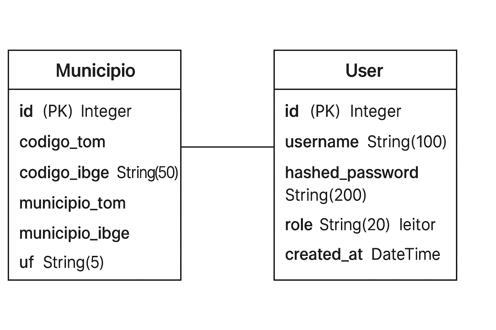

# API de Dados de Municípios do Brasil

Este projeto é uma API REST construída com FastAPI, que disponibiliza dados públicos sobre os municípios do Brasil, obtidos de fontes oficiais do governo federal. Os dados são armazenados localmente em um banco de dados SQLite utilizando SQLAlchemy como ORM. 

## Funcionalidades

- Consulta de dados de municípios do Brasil.

- Busca por estados, nomes de municípios e códigos IBGE.

- API REST rápida e fácil de utilizar.

- Estrutura simples com banco SQLite integrado.

## Tecnologias Utilizadas

- Python 3.10

- FastAPI – Framework para construção da API.

- SQLAlchemy – ORM para manipulação do banco de dados.

- SQLite – Banco de dados local.

- Uvicorn – Servidor ASGI para executar a API.

## Pré-requisitos

- Python 3.10 instalado.

- pip atualizado.

- Git (opcional, caso queira clonar o projeto).

## Instalação

1. Clone o repositório (ou faça download dos arquivos):
```
git clone https://github.com/seu-usuario/seu-projeto.git
cd seu-projeto
```

2. Crie e ative o ambiente virtual:
``` py
python -m venv .venv
# No Linux/Mac
source .venv/bin/activate
# No Windows
.venv\Scripts\activate

```

3. Instale as dependências:
```
pip install --upgrade pip
pip install -r requirements.txt
```

## Configuração do Banco de Dados

O projeto utiliza SQLite, e o banco é criado automaticamente na primeira execução da aplicação. Nenhuma configuração adicional é necessária.

Se desejar, você pode modificar o caminho do banco em context.py:

``` py
DATABASE_URL = "sqlite:///./municipios.db"
```

# Diagrama ER


## Executando a API
Para iniciar o servidor, execute:
``` 
uvicorn main:app --reload
```

- `main` → arquivo principal da aplicação (main.py)
- `app` → instância do FastAPI
- `--reload` → habilita recarga automática ao alterar o código

A API estará disponível em:
```
http://127.0.0.1:8000
```

Crie o usuario admin utilizando o arquivo `create_user_admin.py`. No terminal, dentro da pasta do projeto, execute: 
``` python
py create_user_admin.py
```

## Documentação Automática

O FastAPI fornece documentação automática:

- Swagger UI: http://127.0.0.1:8000/docs
- ReDoc: http://127.0.0.1:8000/redoc

## Contribuição

Contribuições são bem-vindas! Você pode:

- Reportar problemas (issues)
- Sugerir melhorias
- Enviar pull requests

## Licença

Este projeto é open-source.